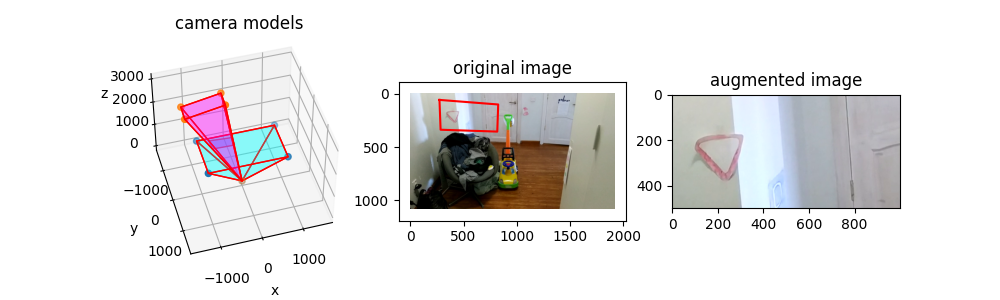

# Camera rotation augmentation visualization
If we know camera focal length we can make virtual camera rotation.  
This code makes the augmentation visualization.  
[camera_rotation.py](./camera_rotation.py) - static visualization  
[camera_rotation_animation.py](./camera_rotation_animation.py) - animation, creates .mp4 file      
code for the augmentation (see details in [camera_rotation.py](./camera_rotation.py)):  
```text
x = np.arange(width_2, dtype=np.float32) - width_2_half
y = np.arange(height_2, dtype=np.float32) - height_2_half
X, Y = np.meshgrid(x, y)
Z = focal_dist_2 * np.ones_like(X)
# rotation from new coordinates to original, as cv2.remap requires
X_rotated = R[0, 0] * X + R[0, 1] * Y + R[0, 2] * Z
Y_rotated = R[1, 0] * X + R[1, 1] * Y + R[1, 2] * Z
Z_rotated = R[2, 0] * X + R[2, 1] * Y + R[2, 2] * Z
X_projected = focal_dist * X_rotated / Z_rotated
Y_projected = focal_dist * Y_rotated / Z_rotated
map_x = X_projected + width_half
map_y = Y_projected + height_half
image_2 = cv2.remap(image, map_x, map_y, cv2.INTER_CUBIC)
```
Result:  

